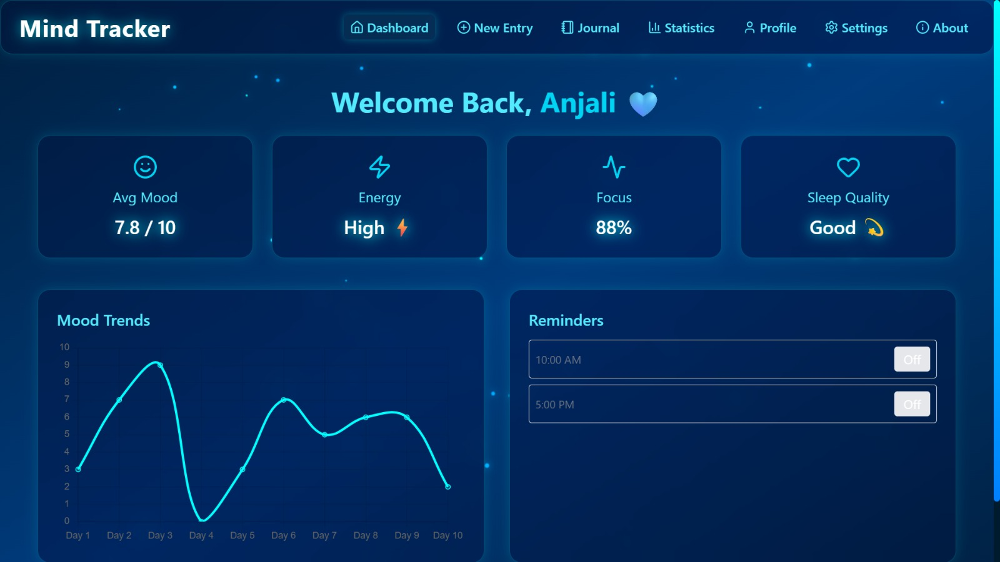
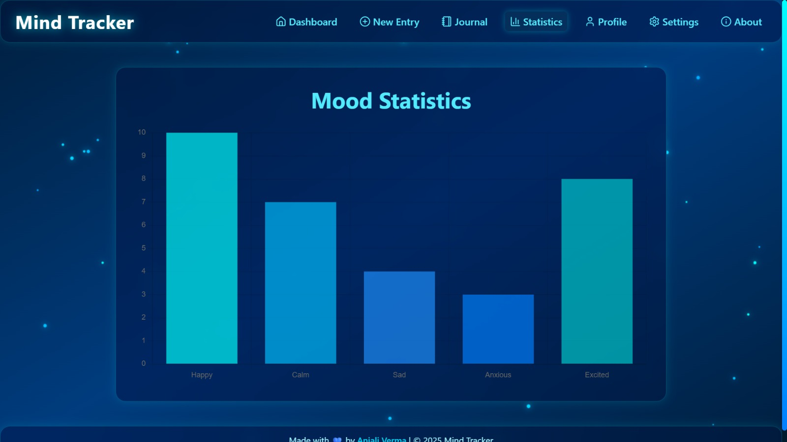
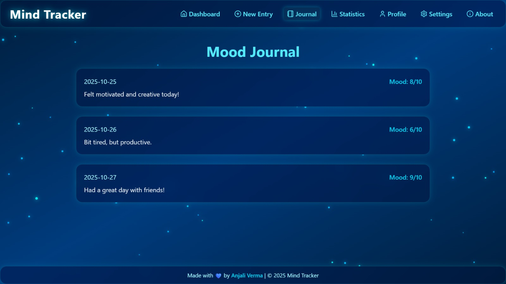

<div align="center">

# 🧠 Mind Tracker  
### *A Futuristic Neon Mood-Tracking Web App*


</div>

---

## 🌟 Overview  

**Mind Tracker** is a futuristic, neon-inspired web app that helps users reflect on their emotional well-being through journaling, mood tracking, and visual insights.  
It merges **aesthetics + analytics**, offering a calm and fluid experience with glowing aqua-blue accents, charts, and animations.

> 💡 Built using **React (Vite)**, **Tailwind CSS**, **Framer Motion**, and **Chart.js**.

---

## ⚙️ Tech Stack  

| Area | Technology |
|------|-------------|
| **Frontend** | React 18, Vite |
| **Styling** | Tailwind CSS, Framer Motion |
| **Charts** | Chart.js, react-chartjs-2 |
| **Icons** | Lucide React |
| **Backend (Planned)** | Node.js, Express.js, MongoDB |
| **Version Control** | Git & GitHub |

---

## 🖥️ Features  

✅ **Mood Charts & Analytics** — Visualize emotions with animated charts  
✅ **Journal Entries** — Save daily reflections  
✅ **Reminders Panel** — Manage habit notifications  
✅ **Futuristic Neon Theme** — Aqua-blue gradients with glowing highlights  
✅ **Smooth Animations** — Page transitions powered by Framer Motion  
✅ **Fully Responsive** — Looks great on all devices  

---

## 📸 Screenshots & Demo Preview  

| Dashboard | Mood Statistics | Journal | Reminders |
|------------|----------------|----------|------------|
|  |  |  |


---

## 🧩 Project Structure  

```bash
mind-tracker/
│
├── backend/               # (to be added by your teammate)
│   ├── server.js
│   ├── routes/
│   ├── models/
│
├── frontend/
│   ├── src/
│   │   ├── api/           # Axios API config
│   │   ├── components/    # Charts, Panels, etc.
│   │   ├── pages/         # Dashboard, Journal, Statistics
│   │   ├── App.jsx
│   │   └── index.jsx
│   ├── styles.css         # Global Tailwind + theme styles
│   ├── tailwind.config.js
│   ├── package.json
│   └── vite.config.js
│
└── README.md
